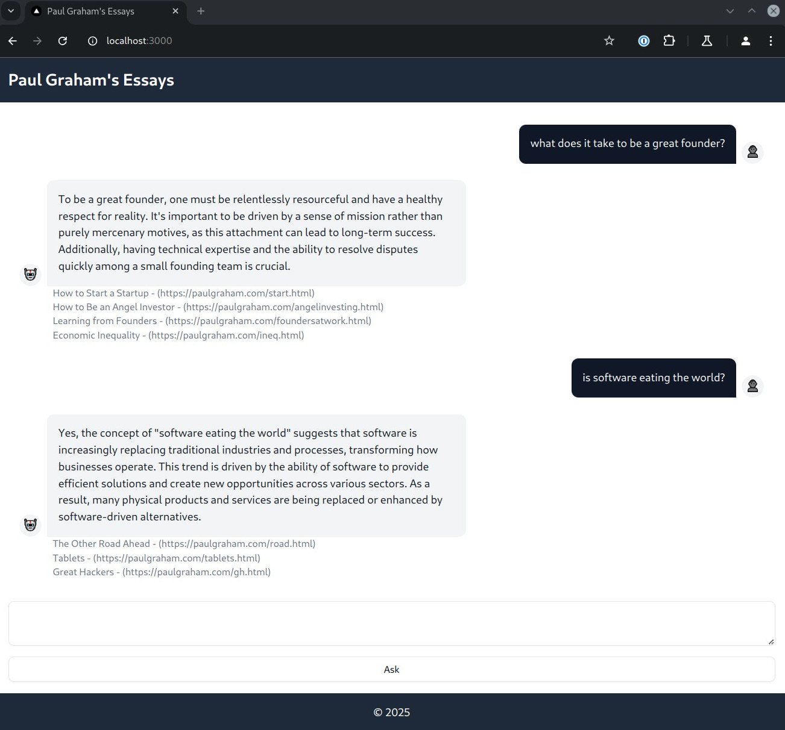

# Paul Graham's Essays

## Setup

* Add the OPEN_API_KEY to two files: [./env](./.env) and [webapp/.env](./webapp/.env).
* Ensure `docker`, `docker-compose` and postgres developer libraries are installed.
* Run `./start.sh`

